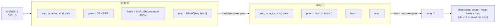
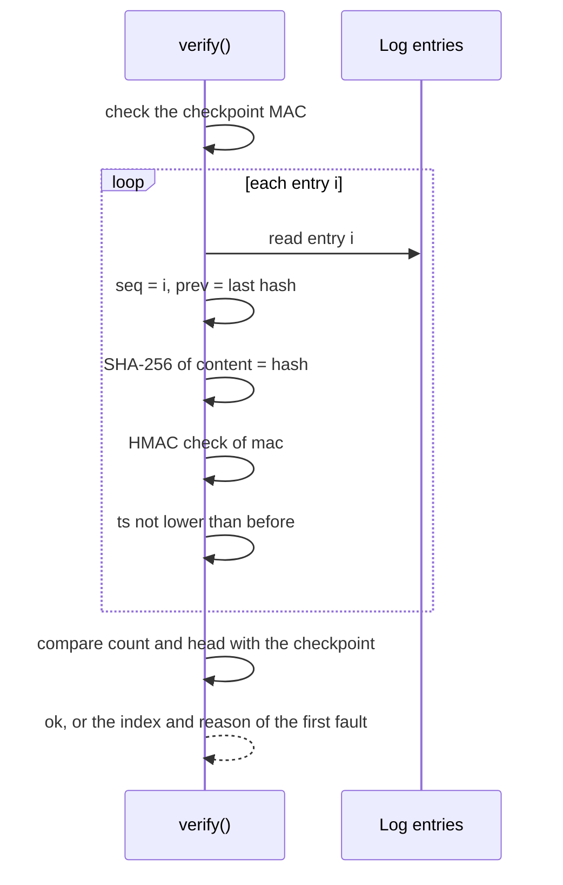
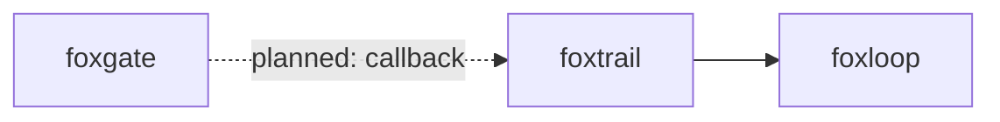

# foxtrail

A tamper-evident audit log for AI agent actions.

foxtrail records what an agent does. Each entry links to the one before it and carries a keyed signature. Anyone who edits, deletes, or reorders an entry breaks the chain. The `foxtrail verify` command then names the first bad line.

## Install

```bash
npm i foxtrail
```

foxtrail needs Node 24 or later, or a browser with Web Crypto.

## Example

```js
import { Log, MemoryStore, generateKey, secret } from "foxtrail";

const log = new Log({ store: new MemoryStore(), key: await generateKey() });

await log.append({
  actor: "agent",
  kind: "tool.call",
  data: { tool: "login", token: secret("sk-live-123") },
});
await log.append({ actor: "agent", kind: "tool.call", data: { tool: "search", query: "flights" } });

const checkpoint = await log.checkpoint();
console.log(await log.verify({ checkpoint }));
// { ok: true, count: 2, head: '…' }
```

The log never stores `sk-live-123`. It stores a salted hash in its place.

To keep a log on disk, use the file store and check it with the CLI:

```js
import { Log } from "foxtrail";
import { FileStore, loadOrCreateKeyFile } from "foxtrail/node";

const key = await loadOrCreateKeyFile("agent.key");
const log = new Log({ store: new FileStore("agent.jsonl"), key });
await log.append({ actor: "agent", kind: "start" });
```

```bash
npx foxtrail verify agent.jsonl --key agent.key
```

## Use cases

| Who | What they build | How foxtrail helps |
|---|---|---|
| A developer of a browser agent | An agent that books travel in the user's browser | Each click and form fill goes in the log. The user can check later what the agent did. |
| A compliance team | Evidence that an AI tool acted within policy | The exported JSONL file and the key let an auditor check every entry. The auditor must hold the key, and anyone with the key can also forge entries. |
| A CI maintainer | A bot that opens pull requests and runs commands | The bot writes to a JSONL file. The CI job runs `foxtrail verify` and fails on any edit. |
| A user of MCP servers | A record of every tool call that an MCP client makes | The client logs each call with `kind: "mcp.call"`. Secrets in the arguments become hashes. |
| A support engineer | A way to replay what an agent did before a bug | The log has the order and the time of each step. A checkpoint shows if the end of the log is missing. |
| A security reviewer | A check that nobody cut the tail of a log | The reviewer keeps a checkpoint somewhere else. `verify` reports `truncated` if entries are gone. |

## How it works

Each entry holds the hash of the entry before it. The hash covers the canonical JSON of the entry. The MAC is an HMAC of that hash. A person with write access can rebuild the hashes, but cannot make valid MACs without the key.



`verify()` walks the log from the first entry and stops at the first fault.



Reasons: `malformed`, `bad-sequence`, `bad-prev`, `bad-hash`, `bad-mac`, `bad-time`, `truncated`, `checkpoint-mismatch`, `bad-checkpoint`. Every failure mode has a test. See [docs/failure-modes.md](docs/failure-modes.md).

## API

```ts
import { Log, MemoryStore, IdbStore, idbKey, generateKey, importKey, exportKeyHex,
         verify, secret, checkRedacted, exportJsonl, parseJsonl } from "foxtrail";
import { FileStore, loadKey, loadOrCreateKeyFile } from "foxtrail/node";
```

| Name | What it does |
|---|---|
| `new Log({ store, key, now?, maxEntryBytes?, redact? })` | Opens a log. `key` is a `CryptoKey`, raw bytes, or a hex string of at least 32 bytes. `redact` lists key names to hash at any depth. |
| `log.append({ actor, kind, data? })` | Adds one entry and returns it. Calls run one at a time. A stale write retries. `ts` never goes down. |
| `log.verify({ checkpoint? })` | Returns `{ ok: true, count, head }` or `{ ok: false, index, reason, message }`. |
| `log.checkpoint()` | Returns a signed `{ count, head, ts, mac }`. |
| `log.exportJsonl()` / `log.importJsonl(text)` | Moves a log as text. Import checks the log first and needs an empty store. |
| `verify(entries, { key, checkpoint? })` | The same check on a plain array. It throws `KeyError` when the key is missing. |
| `secret(value)` | Marks a value. The entry holds `{"$redacted":"<salt>:<sha256>"}`. |
| `checkRedacted(marker, candidate)` | True when `candidate` is the hidden value. |
| `generateKey({ extractable? })`, `importKey`, `exportKeyHex` | HMAC-SHA-256 keys. A key is non-extractable by default. |
| `MemoryStore`, `IdbStore.open(name)`, `FileStore(path)` | The three stores. `FileStore` is in `foxtrail/node`. |
| `idbKey(name, { extractable? })` | Keeps the key in IndexedDB. All tabs get the same key. |

An entry is `{ seq, ts, actor, kind, data, prev, hash, mac }`. `ts` is in milliseconds.

### CLI

```bash
foxtrail verify <file.jsonl> [--key <file>] [--checkpoint <file>]
```

The key file holds the key as hex. Without `--key`, the CLI reads `FOXTRAIL_KEY`.

| Exit code | Meaning |
|---|---|
| 0 | The log is good. |
| 1 | The log is bad. The first bad line is on stderr, for example `line 3: bad-hash: Entry 2 was edited…`. |
| 2 | The command cannot run: no key, no file, or a wrong option. |

## Demo extension

The `extension/` folder holds a demo for Firefox. Its popup records demo events, races two writers on one `IdbStore`, verifies the log, and exports JSONL and a checkpoint.

Build and test it:

```bash
pnpm install
pnpm build:ext   # writes dist-ext/
pnpm e2e         # real Firefox: record, export, verify with the CLI, tamper, verify again
```

The E2E test writes `artifacts/e2e-<date>.json`. The demo key is extractable so that the CLI can verify the export. Use `generateKey()` without `extractable` when only your own code verifies the log.

## Firefox APIs used

| API | Why |
|---|---|
| [`SubtleCrypto.digest`](https://developer.mozilla.org/en-US/docs/Web/API/SubtleCrypto/digest) | SHA-256 of each entry. |
| [`SubtleCrypto.sign` and `verify` (HMAC)](https://developer.mozilla.org/en-US/docs/Web/API/SubtleCrypto/sign) | The MAC of each entry and each checkpoint. `verify` compares in constant time. |
| [`SubtleCrypto.generateKey`](https://developer.mozilla.org/en-US/docs/Web/API/SubtleCrypto/generateKey) | A key that code cannot export. |
| [`IndexedDB`](https://developer.mozilla.org/en-US/docs/Web/API/IndexedDB_API) | The browser store, and the place where the `CryptoKey` object lives. |
| [`URL.createObjectURL`](https://developer.mozilla.org/en-US/docs/Web/API/URL/createObjectURL) | The download link for the JSONL export. |
| [`unlimitedStorage` permission](https://developer.mozilla.org/en-US/docs/Mozilla/Add-ons/WebExtensions/manifest.json/permissions) | The browser does not evict the log. |
| [`action` popup](https://developer.mozilla.org/en-US/docs/Mozilla/Add-ons/WebExtensions/manifest.json/action) | The demo interface. |

The library itself uses only Web Crypto and IndexedDB, so it also runs in other browsers.

## Limits

- foxtrail is tamper-evident, not tamper-proof. A person with the key can rewrite the whole log.
- HMAC is a shared secret. Anyone who verifies a log can also forge one. Public-key signatures (Ed25519) are not built.
- A cut tail is visible only when you hold a checkpoint from before the cut. foxtrail does not store checkpoints for you.
- A non-extractable key cannot go to the CLI. Only code in the same browser can verify such a log.
- `ts` comes from the local clock. foxtrail keeps it from going down, but does not prove it is true.
- A redacted value is a salted SHA-256. A short or guessable secret can be guessed from the hash. `actor` and `kind` are never redacted.
- foxtrail does not normalize Unicode. A text change from NFC to NFD counts as an edit.
- `verify` reads the whole log into memory. There is no rotation or compaction.
- The file lock is a lock file with an owner token. A crashed process leaves it for 10 seconds before the next writer moves it away. A writer that loses its lock fails with `StoreError`.
- A JSONL line with a repeated key is refused, and a checkpoint file must hold an object.
- Whitespace and key order in a JSONL line are not signed. Only the values are.
- Only Firefox runs the E2E test. The package is not on npm yet.

## Part of the fox primitives



foxtrail depends on no other fox repo. [foxloop](https://github.com/pooriaarab/foxloop) will record its steps with it. [foxgate](https://github.com/pooriaarab/foxgate) will call it through a callback later.

## License

MIT
